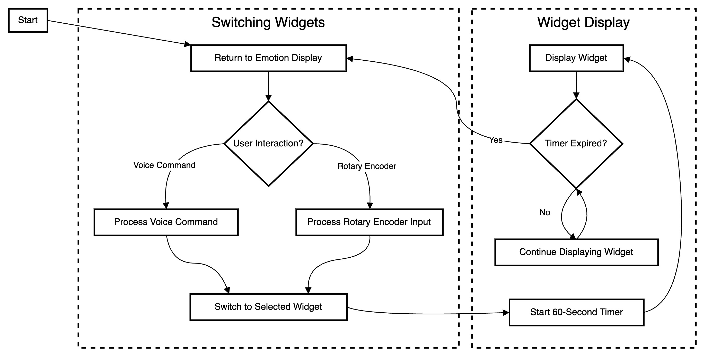
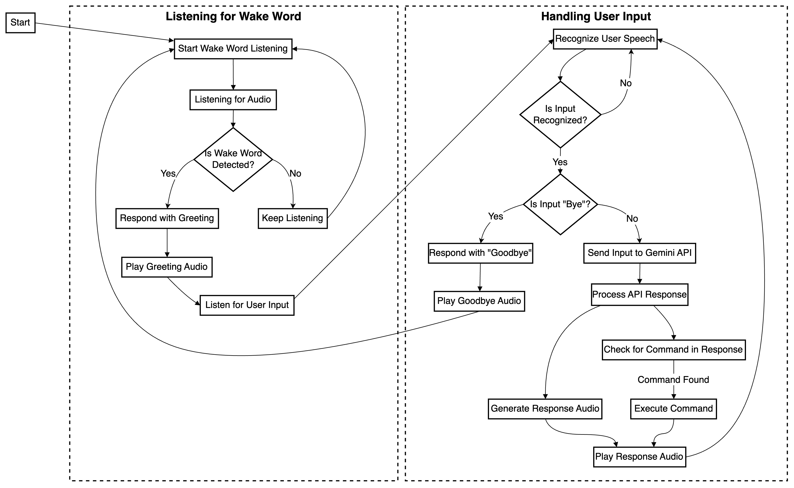
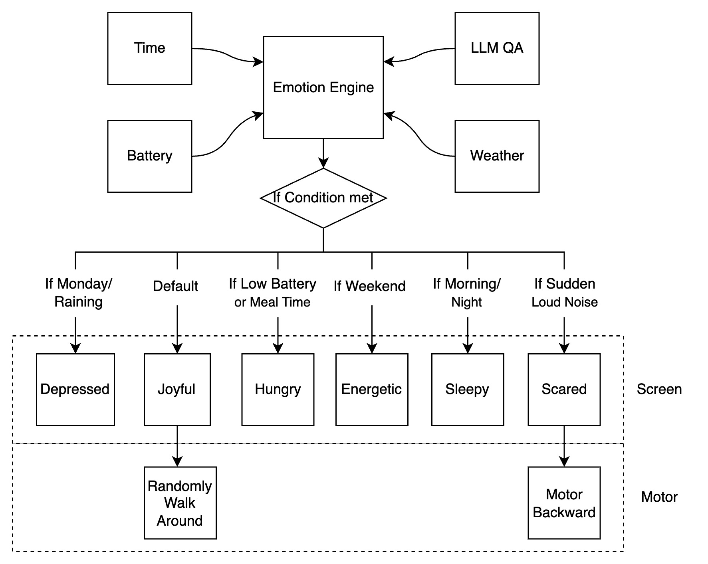
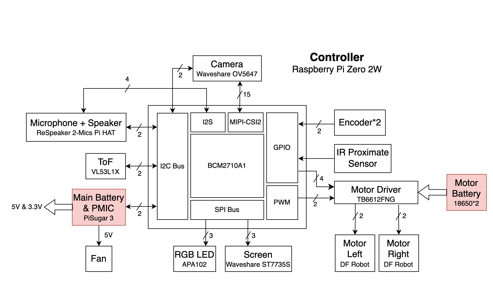

# Pi-Buddy: Your Intelligent Desktop Companion

## Briefing
Pi-Buddy is an advanced robot powered by Raspberry Pi Zero 2W and equipped with multiple sensors. It offers features such as note-taking, photo capture, meeting recording, to-do management, weather updates, and voice interaction. It also responds emotionally, adjusting its mood based on user interactions and environments.

## Software
## System Overview
The system operates with three main threads that manage user interactions: 
* AudioHandler
* MenuScreenHandler (WidgetHandler)
* EmotionHandler

In addition, several minor threads provide supplementary functions, such as:
* EncoderHandler for menu navigation
* BatteryHandler for managing battery-related tasks
* RobotMovementHandler for controlling the robot's movement
* TeleopHandler (teleoperation), which allows direct control of the robot via keyboard input.

The core of the system’s communication is a handler mechanism that operates continuously, where each ‘requester’ adds tasks to a queue, and the appropriate ‘handler’ executes the task. This ensures modular interaction between components.


### MenuScreenHandler(WidgetHandler): How Pi-Buddy Manages Multiple Widgets
Pi-Buddy provides a variety of useful widgets, such as a to-do list, weather updates, timers, and more. These widgets can be easily accessed either through voice commands or by using the rotary encoder for manual selection.

1. Default Emotion Display
The default screen for Pi-Buddy shows its current emotion, giving it a lifelike presence. Whenever you interact with a widget, Pi-Buddy temporarily switches to that page, but the emotion display will always return after the interaction. (src/handler/encoder_handler.py)

2. Widget Switching with a Timeout
Once a widget is selected:
    * Pi-Buddy switches from the emotion page to the new widget.
    * A 60-second expiration timer starts, counting down while the widget is displayed.
    * After 60 seconds, Pi-Buddy automatically returns to the emotion page, similar to a smartphone screen timeout feature, ensuring that the robot's mood is always visible.

3. Flexible Navigation
Whether using voice commands or the rotary encoder, Pi-Buddy provides an intuitive and smooth experience, switching seamlessly between widgets while always returning to its default emotional display.
<div align="center">

</div>

### AudioHandler: How Pi-Buddy Listens and Responds
Pi-Buddy is equipped with an advanced audio handler, enabling it to both respond to commands and engage in conversation. Whether you're giving it a task or simply chatting, Pi-Buddy's audio system ensures smooth, natural communication.

1. Listening for the Wake Word
Pi-Buddy is always on the lookout for its wake word. Once you say "Hey," it recognizes the signal and responds with a friendly greeting, ready to either take commands or have a chat.

2. Recognizing and Processing Speech
After hearing the wake word, Pi-Buddy listens closely to what you say next. If you're saying "Goodbye", Pi-Buddy will respond with a polite farewell. Otherwise, it processes your speech and sends it to Google Gemini to understand your intent.

3. Smart Response and Task Execution
Pi-Buddy determines if you're giving a command (like setting a timer or asking for the weather) or just chatting. It responds intelligently, either executing a command or continuing the conversation in a natural, engaging way.

4. Continuous Listening
Once Pi-Buddy completes its task or response, it goes back to listening mode, ready for the next interaction.

<div align="center">

</div>

### EmotionHandler: How Pi-Buddy Reacts to Its Environment
Pi-Buddy doesn’t just follow commands—it feels! The Emotion Engine allows Pi-Buddy to sense its environment and adapt its mood, giving it a personality that changes with the time of day, weather, or even sudden loud noises.

1. Environment-Based Emotion Changes
Pi-Buddy’s mood depends on a variety of factors, such as:
    * Time: Pi-Buddy feels sleepy during the night or energetic during the weekend.
    * Weather: If it’s a rainy Monday, Pi-Buddy becomes depressed.
    * Battery Status: When the battery runs low or it’s time for a meal, Pi-Buddy gets hungry.
    * Loud Noise: Sudden loud noises make Pi-Buddy feel scared, causing it to react defensively by moving backward.
2. Mood-Based Reactions
Pi-Buddy’s emotions aren’t just displayed on the screen—they influence its behavior:
    * If Pi-Buddy is joyful, it might randomly walk around.
    * If Pi-Buddy is scared, it will move backward in response to danger.
3. Dynamic Mood Shifts
Pi-Buddy’s emotion engine processes inputs from:
    * Time and Weather services to determine the external environment.
    * Battery levels to detect its own energy state.
    * LLM QA to interact and respond emotionally during conversations.

By continuously sensing its surroundings and adjusting its mood, Pi-Buddy becomes more than just a robot—it becomes a responsive companion with a range of emotions.

<div align="center">

</div>

## Hardware
<div align="center">

</div>

### Components Used
* Display: Waveshare ST7735S 1.8 inches LCD Display (SPI)
* Camera: Raspberry Pi Camera OV5647 (MIPI-CSI2)
* Speaker & Microphone: Seeed Studio ReSpeaker 2-Mic Hat (I2S + I2C)
* Battery & PMIC: PiSugar3 (I2C)
* Motor Driver: TB6612FNG (GPIO + PWM)
* Motors: DFRobot Metal DC Geared Motor w/Encoder - 6V 210RPM 10Kg\.cm
* Encoders(GPIO)
* Distance Sensors: ToF (I2C) for obstacle avoidance and IR (GPIO) for fall prevention

Most of the components use custom drivers written with RPi.GPIO, spidev, and smbus2 libraries for interfacing.

### Pin definitions
|Connection|BCM|Physical|Physical|BCM|Connection|
|---|---|---|---|---|---|
|X|3.3V|1|2|5V|X|
|I2C SDA|GPIO 2|3|4|5V|X|
|I2C SCL|GPIO 3|5|6|G|X|
|Motor ENC1A|GPIO 4|7|8|GPIO 14|LCD DC|
|X|G|9|10|GPIO 15|LCD RST|
|Motor ENC1B|GPIO 17|11|12|GPIO 18|I2S CLK|
|Motor ENC2A|GPIO 27|13|14|G|X|
|Motor ENC2B|GPIO 22|15|16|GPIO 23|Motor PWMA|
|X|3.3V|17|18|GPIO 24|Motor INA1|
|SPI MOSI/LCD DIN|GPIO 10|19|20|G|X|
|SPI MISO|GPIO 9|21|22|GPIO 25|Motor INA2|
|SPI SCLK/LCD SCK|GPIO 11|23|24|GPIO 8|Reserved by SPI|
|X|G|25|26|GPIO 7|Reserved by SPI|
|Menu ENC1A|GPIO 0|27|28|GPIO 1|Motor PWMB|
|Menu ENC1B|GPIO 5|29|30|G|X|
|Menu ENC2A|GPIO 6|31|32|GPIO 12|Motor INB1|
|Menu ENC2B|GPIO 13|33|34|G|X|
|I2S WS|GPIO 19|35|36|GPIO 16|Motor INB2|
|IR|GPIO 26|37|38|GPIO 20|I2S DIN|
|X|G|39|40|GPIO 21|I2S DOUT|

## How to Use
### Installation
```bash
./install.sh
```
### Run Pi-Buddy
```bash
source .venv/bin/activate
cd src
python main.py
```
